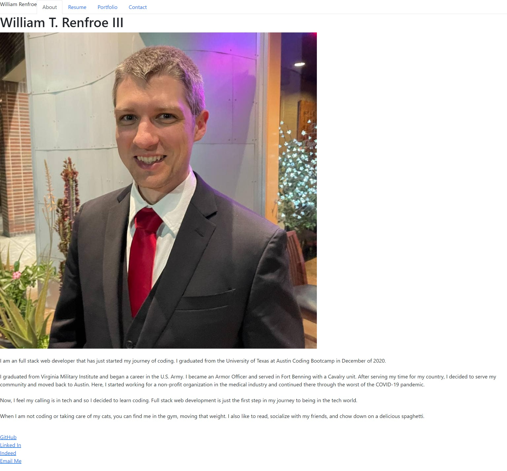
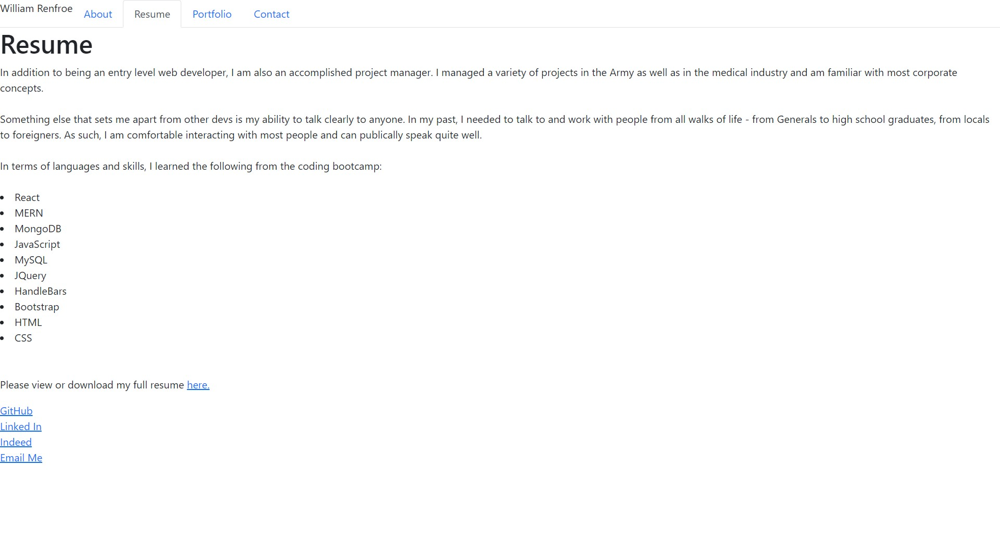
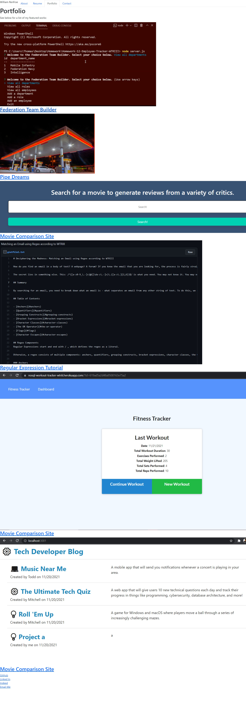
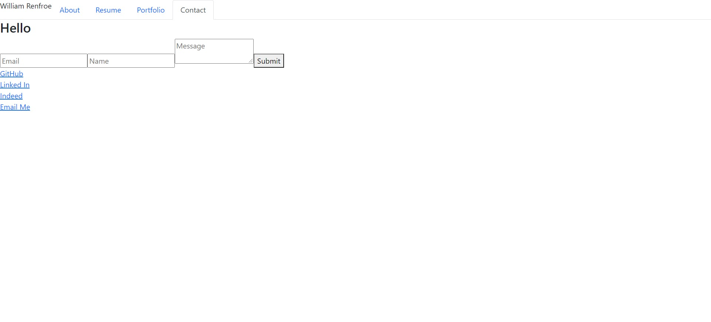

# William Thomas Renfroe III React Portfolio

## Summary

This is a portfolio I created as part of a coding bootcamp with UT Austin and Trilogy. 

The portfolio uses React as its framework and is very much a work in progress. 

Here is the link to the live Heroku site: https://portfolio-wtriii.herokuapp.com/

## Below are images of the site:

## Landing Page:

## Resume Page

## Portfolio Page

## Contact Page

### Help Received

I received assistance from my final project group members on getting the portfolio set up:

Mitchell Robbins for the Footer - https://github.com/Mitchell-est-Robbins
Brian Albright for the Contact form - https://github.com/bmalbright
James Garinger for the moral support - https://github.com/originator1

